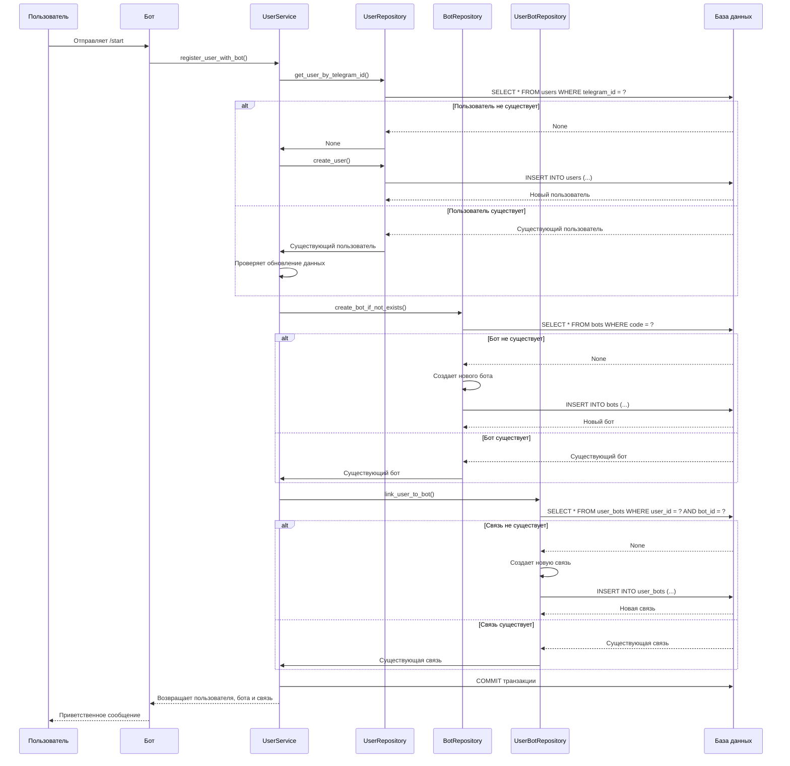

# Документация Mommy Platform

## Обзор

Mommy Platform - это модульная платформа для создания и управления Telegram ботами на основе aiogram. Платформа предоставляет четкую архитектуру с разделением ответственности между компонентами.

## Содержание

### Основная документация
- [Создание нового бота](создание-бота.md) - Полное руководство по созданию бота с нуля

### Архитектура
- **Модульная структура**: Каждый бот - отдельный модуль с четкими границами
- **Factory Pattern**: Регистрация ботов через фабричные функции
- **Simple Container**: Упрощенный контейнер для создания компонентов бота
- **Registry Pattern**: Централизованное управление ботами через реестр
- **Database Layer**: Асинхронная работа с PostgreSQL через SQLAlchemy
- **Repository Pattern**: Изоляция логики доступа к данным
- **Service Layer**: Бизнес-логика в сервисах
- **User Management**: Система регистрации пользователей и связи с ботами

### Ключевые компоненты
- **BotRegistry** - Центральный реестр для управления ботами
- **BotContainer** - Упрощенный контейнер для создания компонентов бота
- **BotClient** - Абстракция клиента бота (aiogram-based)
- **BotRouter** - Маршрутизация команд и сообщений
- **BotService** - Бизнес-логика бота
- **Database** - Конфигурация и управление подключением к БД
- **Models** - Модели данных SQLAlchemy
- **Repositories** - Паттерн репозитория для работы с данными
- **Services** - Сервисы бизнес-логики (UserService)
- **Filters** - Фильтры для обработки сообщений
- **Middlewares** - Middleware для обработки запросов

## Быстрый старт

1. **Настройте базу данных**: Установите PostgreSQL и создайте БД
2. **Настройте конфигурацию**: Добавьте параметры БД в `.env` и `config.py`
3. **Примените миграции**: `alembic upgrade head`
4. **Изучите архитектуру**: Прочитайте [создание-бота.md](создание-бота.md)
5. **Создайте структуру**: Следуйте пошаговой инструкции
6. **Зарегистрируйте бота**: Добавьте фабричную функцию в `__init__.py`
7. **Запустите платформу**: `python main.py`

## Примеры

Изучите существующий бот в папке [`bots/srv_servicebot/`](../bots/srv_servicebot/) для понимания практической реализации.

## Работа с базой данных

### Модели данных
Модели SQLAlchemy находятся в [`core/models/db/`](../core/models/db/). Пример модели пользователя:
```python
class User(Base):
    __tablename__ = "users"
    id = Column(Integer, primary_key=True)
    telegram_id = Column(BigInteger, nullable=False, unique=True, index=True)
    name = Column(String(255), nullable=False)
    lang = Column(String(10), default="en")
    created_at = Column(DateTime(timezone=True), server_default=func.now())

    # Связь многие-ко-многим с ботами
    bots = relationship("Bot", secondary="user_bots", back_populates="users")
```

### Репозитории
Репозитории для работы с данными в [`core/repositories/`](../core/repositories/):
```python
class UserRepository:
    async def create_user(self, *, user_id: int, name: str, lang: str) -> User:
        user = User(telegram_id=user_id, name=name, lang=lang)
        self.session.add(user)
        await self.session.flush()
        return user

class BotRepository:
    async def create_bot_if_not_exists(self, bot_code: str, bot_name: str) -> Bot:
        """Создать бота, если он не существует"""
        bot = await self.get_bot_by_code(bot_code)
        if not bot:
            bot = Bot(code=bot_code, name=bot_name)
            self.session.add(bot)
            await self.session.flush()
        return bot
```

### Миграции
Используйте Alembic для управления схемой базы данных:
```bash
# Создание миграции
alembic revision --autogenerate -m "Описание изменений"

# Применение миграций
alembic upgrade head
```

## Система пользователей

### Архитектура системы
Система пользователей построена на связи многие-ко-многим между пользователями и ботами:

```
Пользователи (users) ←→ Связи (user_bots) ←→ Боты (bots)
```

### Модели данных

#### Пользователь (User)
```python
class User(Base):
    __tablename__ = "users"
    id = Column(Integer, primary_key=True)
    telegram_id = Column(BigInteger, nullable=False, unique=True, index=True)
    name = Column(String(255), nullable=False)
    lang = Column(String(10), default="en")
    created_at = Column(DateTime(timezone=True), server_default=func.now())

    # Связь многие-ко-многим с ботами
    bots = relationship("Bot", secondary="user_bots", back_populates="users")
```

#### Бот (Bot)
```python
class Bot(Base):
    __tablename__ = "bots"
    id = Column(Integer, primary_key=True)
    code = Column(String(50), unique=True, nullable=False)  # Уникальный код бота
    name = Column(String(255), nullable=False)              # Отображаемое имя

    # Связь многие-ко-многим с пользователями
    users = relationship("User", secondary="user_bots", back_populates="bots")
```

#### Связь пользователь-бот (UserBot)
```python
class UserBot(Base):
    __tablename__ = "user_bots"
    id = Column(Integer, primary_key=True)
    user_id = Column(Integer, ForeignKey("users.id", ondelete="CASCADE"))
    bot_id = Column(Integer, ForeignKey("bots.id", ondelete="CASCADE"))
    first_used_at = Column(DateTime(timezone=True), server_default=func.now())

    # Уникальное ограничение: один пользователь может быть связан с одним ботом только один раз
    __table_args__ = (UniqueConstraint("user_id", "bot_id", name="uq_user_bot"),)
```

### Процесс регистрации пользователя

#### 1. UserService
Сервис для управления пользователями и их связью с ботами в [`services/user_service.py`](../services/user_service.py):

```python
class UserService:
    async def register_user_with_bot(self, user: UserModel, bot_code: str, bot_name: str):
        """
        Регистрирует пользователя и связывает его с ботом.
        Если пользователь уже существует, обновляет его данные и создает связь с ботом.
        """
        user_repo = UserRepository(self.session)
        bot_repo = BotRepository(self.session)
        user_bot_repo = UserBotRepository(self.session)

        # Получаем или создаем пользователя
        db_user = await user_repo.get_user_by_telegram_id(user.tg_id)
        if not db_user:
            db_user = await user_repo.create_user(user_id=user.tg_id, name=user.name, lang=user.lang)

        # Получаем или создаем бота
        bot = await bot_repo.create_bot_if_not_exists(bot_code, bot_name)

        # Создаем связь между пользователем и ботом
        user_bot = await user_bot_repo.link_user_to_bot(db_user.id, bot.id)

        # Если пользователь уже существовал, обновляем его данные
        if db_user.name != user.name or db_user.lang != user.lang:
            db_user.name = user.name
            db_user.lang = user.lang
            await self.session.flush()

        await self.session.commit()
        return db_user, bot, user_bot
```

#### 2. Отслеживание использования ботов
Система автоматически отслеживает:
- **Первый раз использования**: `first_used_at` - время первой связи пользователя с ботом
- **Уникальные связи**: Один пользователь может быть связан с одним ботом только один раз
- **Обновление данных**: Если пользователь меняет имя или язык, данные обновляются

#### 3. Получение информации о пользователях и ботах
```python
# Получить пользователя по telegram_id
user = await user_service.get_user_by_telegram_id(123456789)

# Получить список ботов пользователя
bots = await user_service.get_user_bots(123456789)

# Получить бота по коду
bot = await bot_repo.get_bot_by_code('service_bot')
```

### UserMiddleware
Middleware для автоматического внедрения сервиса пользователей в обработчики:
```python
class UserMiddleware(BaseMiddleware):
    async def __call__(self, handler, event, data):
        session = data["db_session"]
        data["user_service"] = UserService(session)
        return await handler(event, data)
```

### Использование в ботах

#### 1. Регистрация пользователя при первом использовании
```python
async def start(self, message: Message):
    user_service = data["user_service"]

    # Регистрируем пользователя при первом использовании
    user_model = UserModel(
        tg_id=message.from_user.id,
        name=message.from_user.first_name or "Пользователь",
        lang=message.from_user.language_code or "en"
    )

    db_user, bot, user_bot = await user_service.register_user_with_bot(
        user_model,
        bot_code='your_bot_code',
        bot_name='Your Bot Name'
    )

    await message.answer(f"Добро пожаловать, {db_user.name}!")
```

#### 2. Получение информации о пользователе
```python
async def profile(self, message: Message):
    user_service = data["user_service"]

    # Получаем пользователя
    user = await user_service.get_user_by_telegram_id(message.from_user.id)

    if user:
        # Получаем боты пользователя
        bots = await user_service.get_user_bots(message.from_user.id)
        bot_names = [bot.name for bot in bots]

        await message.answer(
            f"Профиль: {user.name}\n"
            f"Язык: {user.lang}\n"
            f"Боты: {', '.join(bot_names)}"
        )
```

### Диаграмма процесса регистрации пользователя



### Тестирование
Для проверки функциональности системы пользователей используйте [`test_user_registration.py`](../test_user_registration.py):
```bash
python test_user_registration.py
```

Тест проверяет:
- Регистрацию нового пользователя
- Создание связи с ботом
- Предотвращение дублирующих связей
- Обновление данных существующего пользователя
- Получение списка ботов пользователя

## Фильтры и Middleware

### Фильтры
Фильтры позволяют гибко настраивать обработку сообщений. Пример фильтра для приватных чатов:

```python
from aiogram.filters import BaseFilter
from aiogram.types import Message

class IsPrivateChat(BaseFilter):
    async def __call__(self, message: Message) -> bool:
        return message.chat.type == "private"

# Применение фильтра
self._router.message.register(self.start, Command("start"), IsPrivateChat())
```

### Middleware
Middleware позволяют обрабатывать запросы до их достижения обработчиков. Пример middleware для исключения ботов:

```python
from aiogram import BaseMiddleware
from aiogram.types import TelegramObject
from typing import Callable, Any, Awaitable
from utils.telegram import get_user_from_update

class IsBotMiddleware(BaseMiddleware):
    async def __call__(
        self,
        handler: Callable[[TelegramObject, dict], Awaitable[Any]],
        event: TelegramObject,
        data: dict
    ):
        user = get_user_from_update(event)

        if not user:
            return await handler(event, data)

        if user.is_bot:
            return

        return await handler(event, data)

# Применение middleware
self.dp.update.middleware(IsBotMiddleware())
```

### Утилиты для работы с Telegram
Для извлечения пользователя из обновления используется утилитарная функция:

```python
from aiogram.types import Update, User

def get_user_from_update(update: Update) -> User | None:
    if update.message:
        return update.message.from_user
    if update.callback_query:
        return update.callback_query.from_user
    if update.inline_query:
        return update.inline_query.from_user
    return None
```

## Поддержка

При возникновении проблем:
1. Проверьте раздел "Возможные проблемы и их решения" в основной документации
2. Убедитесь в правильности конфигурации
3. Проверьте логи приложения

---
*Документация обновлена: 2026-02-04*
*Добавлена информация о системе пользователей, сервисах и тестировании*
