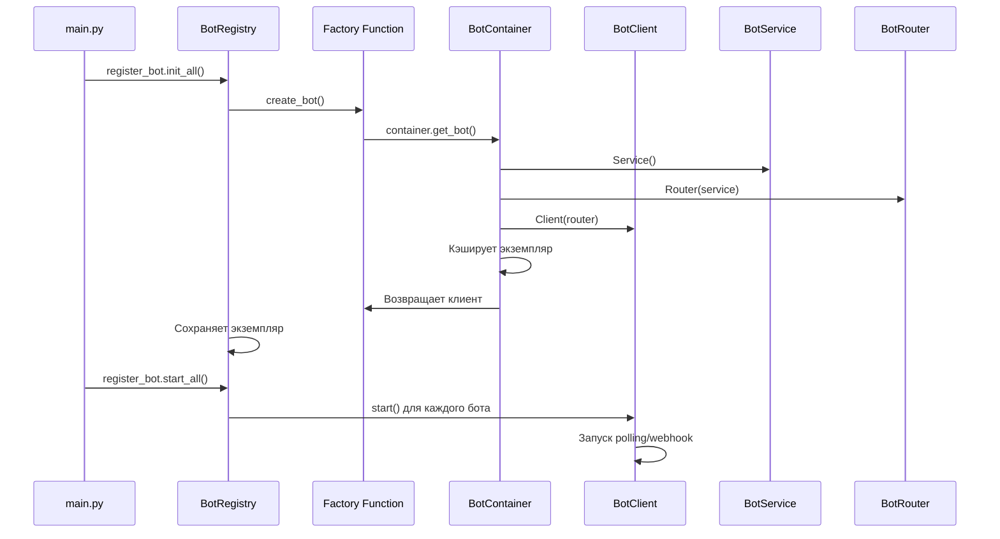
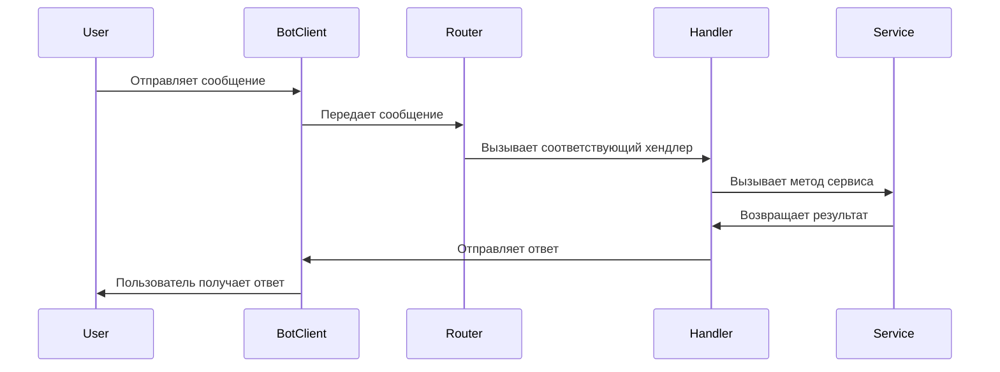
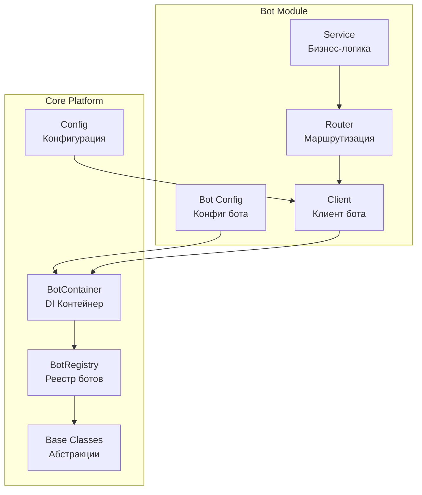

# Создание нового бота в Mommy Platform

## Оглавление
1. [Обзор архитектуры](#обзор-архитектуры)
2. [Создание нового бота: пошаговая инструкция](#создание-нового-бота-пошаговая-инструкция)
3. [Работа с базой данных](#работа-с-базой-данных)
4. [Диаграммы взаимодействия](#диаграммы-взаимодействия)
5. [Возможные проблемы и их решения](#возможные-проблемы-и-их-решения)
6. [Лучшие практики](#лучшие-практики)

---

## Обзор архитектуры

Mommy Platform построена по модульной архитектуре с четким разделением ответственности между компонентами:

### Ключевые компоненты

#### 1. **BotRegistry** ([`core/registry.py`](core/registry.py:1))
- **Назначение**: Центральный реестр для регистрации и управления всеми ботами
- **Функции**:
  - Регистрация фабрик ботов
  - Инициализация всех ботов
  - Параллельный запуск/остановка
  - Обработка ошибок

#### 2. **BotClient** ([`core/base/client.py`](core/base/client.py:1))
- **Назначение**: Абстрактный базовый класс для клиентов ботов
- **Обязательные методы**: `start()`, `stop()`
- **Реализация**: [`AiogramBotClient`](core/clients/aiogram_client.py:7)

#### 3. **BotRouter** ([`core/base/router.py`](core/base/router.py:1))
- **Назначение**: Абстрактный класс для маршрутизаторов команд
- **Свойство**: `router` - возвращает aiogram.Router

#### 4. **BotService** ([`core/base/service.py`](core/base/service.py:1))
- **Назначение**: Бизнес-логика бота

### Архитектурный паттерн
Платформа использует паттерн **Factory + Simple Container + Registry + Repository**:
- **Factory**: Создает экземпляры ботов через фабричные функции
- **Simple Container**: Упрощенный контейнер для создания компонентов бота
- **Registry**: Централизованное управление ботами через реестр
- **Repository**: Изоляция логики доступа к данным от бизнес-логики

#### 5. **BotContainer** ([`core/bot_container.py`](core/bot_container.py:1))
- **Назначение**: Упрощенный контейнер для создания компонентов бота
- **Функции**:
  - Регистрация конфигураций ботов
  - Создание компонентов бота (сервис → роутер → клиент)
  - Кэширование созданных экземпляров
  - Простое управление зависимостями

#### 6. **Database Layer** ([`core/database.py`](core/database.py:1))
- **Назначение**: Конфигурация и управление подключением к PostgreSQL
- **Компоненты**:
  - **Database** - Класс для управления подключением и сессиями
  - **Base** - Базовый класс для моделей SQLAlchemy
  - **Models** - Модели данных в [`core/models/db/`](core/models/db/)
  - **Repositories** - Репозитории для работы с данными в [`core/repositories/`](core/repositories/)
  - **Services** - Сервисы бизнес-логики в [`services/`](services/)
  - **Middlewares** - Middleware для обработки запросов в [`middlewares/`](middlewares/)

---

## Создание нового бота: пошаговая инструкция

### Шаг 1: Создание структуры папки бота

Создайте новую папку в директории `bots/`:

```
bots/
└── ваш_бот/
    ├── __init__.py      # Регистрация бота
    ├── client.py        # Клиент бота
    ├── router.py        # Маршрутизатор команд
    └── service.py       # Бизнес-логика
```

### Шаг 2: Настройка конфигурации

Добавьте переменную окружения в [`utils/config.py`](utils/config.py:5):

```python
class Config(BaseSettings):
    # ... существующие настройки
    ВАШ_БОТ_TOKEN: SecretStr  # Добавьте эту строку
```

И в файл `.env`:
```
ВАШ_БОТ_TOKEN=your_bot_token_here
```

### Шаг 3: Создание Service (бизнес-логика)

[`bots/ваш_бот/service.py`](bots/ваш_бот/service.py:1):
```python
from core.base.service import BotService

class ВашБотService(BotService):
    async def start_command(self):
        return "Добро пожаловать в ВашБот!"

    async def handle_message(self, text: str):
        # Ваша бизнес-логика
        return f"Вы сказали: {text}"
```

### Шаг 4: Создание Router (маршрутизатор)

[`bots/ваш_бот/router.py`](bots/ваш_бот/router.py:1):
```python
from aiogram import Router
from aiogram.types import Message
from aiogram.filters import Command, Text
from core.base.router import BotRouter
from .service import ВашБотService

class ВашБотRouter(BotRouter):
    def __init__(self, service: ВашБотService):
        self._router = Router()
        self._service = service
        self._register_handlers()

    def _register_handlers(self):
        # Регистрация команды /start
        self._router.message.register(self.start, Command("start"))

        # Регистрация обработки текстовых сообщений
        self._router.message.register(self.handle_message, Text())

    @property
    def router(self) -> Router:
        return self._router

    async def start(self, message: Message):
        text = await self._service.start_command()
        await message.answer(text)

    async def handle_message(self, message: Message):
        text = await self._service.handle_message(message.text)
        await message.answer(text)
```

### Шаг 5: Создание Client (клиент)

[`bots/ваш_бот/client.py`](bots/ваш_бот/client.py:1):
```python
from core.clients.aiogram_client import AiogramBotClient
from core.models.client_config import BotClientConfig
from core.models.bot_mode import BotMode
from aiogram import Router
from utils.config import config

class ВашБотClient(AiogramBotClient):
    name = "ваш_бот"  # Уникальное имя бота

    def __init__(self, router: Router):
        super().__init__(
            name=self.name,
            config=BotClientConfig(
                token=config.ВАШ_БОТ_TOKEN.get_secret_value(),
                mode=BotMode.POLLING,  # или BotMode.WEBHOOK
                webhook_url=None
            )
        )
        self.dp.include_router(router)
```

### Шаг 6: Конфигурация бота

Добавьте конфигурацию бота в [`utils/bots_config.py`](utils/bots_config.py:1):
```python
from bots.ваш_бот.service import ВашБотService
from bots.ваш_бот.router import ВашБотRouter
from bots.ваш_бот.client import ВашБотClient

BOT_CONFIGS = {
    'ваш_бот': {
        'name': 'ваш_бот',
        'service_class': ВашБотService,
        'router_class': ВашБотRouter,
        'client_class': ВашБотClient,
        'dependencies': {}  # Дополнительные зависимости
    }
}
```

### Шаг 7: Регистрация бота

[`bots/ваш_бот/__init__.py`](bots/ваш_бот/__init__.py:1):
```python
from core.registry import register_bot
from core.bot_container import container
from utils.bots_config import BOT_CONFIGS

# Регистрируем конфигурацию в DI контейнере
container.register_bot(BOT_CONFIGS['ваш_бот']['name'], BOT_CONFIGS['ваш_бот'])

def create_bot():
    # Контейнер создаёт бота по конфигурации
    return container.get_bot(BOT_CONFIGS['ваш_бот']['name'])

# Регистрация фабрики в системе
register_bot.register(BOT_CONFIGS['ваш_бот']['name'], create_bot)
```

### Шаг 8: Запуск платформы

Запустите основное приложение:
```bash
python main.py
```

Платформа автоматически:
1. Импортирует все модули ботов
2. Регистрирует конфигурации в DI контейнере
3. Создаёт экземпляры ботов через фабрики
4. Запускает всех ботов параллельно

---

## Работа с базой данных

### Настройка базы данных

#### 1. Конфигурация подключения
Добавьте параметры БД в [`utils/config.py`](utils/config.py:5):
```python
class Config(BaseSettings):
    # ... существующие настройки

    # Настройки базы данных
    DB_HOST: str
    DB_PORT: str = "5432"
    DB_NAME: str
    DB_USER: str
    DB_PASSWORD: SecretStr
    DB_ENGINE: str = "postgresql"
    DB_DEV_MODE: Optional[bool] = True

    def get_db_url(self):
        return f"{self.DB_ENGINE}://{self.DB_USER}:{self.DB_PASSWORD.get_secret_value()}@{self.DB_HOST}:{self.DB_PORT}/{self.DB_NAME}"
```

И в файл `.env`:
```
DB_HOST=localhost
DB_PORT=5432
DB_NAME=hope_platform
DB_USER=postgres
DB_PASSWORD=your_password_here
DB_DEV_MODE=True
DB_ENGINE=postgresql
```

#### 2. Применение миграций
```bash
# Применить все миграции
alembic upgrade head

# Создать новую миграцию (после изменения моделей)
alembic revision --autogenerate -m "Описание изменений"
```

### Использование базы данных в ботах

#### 1. Создание модели данных
Создайте модель в [`core/models/db/`](core/models/db/):
```python
from sqlalchemy import Column, Integer, String, DateTime, Text
from sqlalchemy.sql import func
from core.database import Base

class YourModel(Base):
    __tablename__ = "your_table"

    id = Column(Integer, primary_key=True, index=True)
    name = Column(String(255), nullable=False)
    created_at = Column(DateTime(timezone=True), server_default=func.now())
```

#### 2. Создание репозитория
Создайте репозиторий в [`core/repositories/`](core/repositories/):
```python
from sqlalchemy.ext.asyncio import AsyncSession
from sqlalchemy import select
from core.models.db.your_model import YourModel

class YourRepository:
    def __init__(self, session: AsyncSession):
        self.session = session

    async def create_item(self, name: str) -> YourModel:
        item = YourModel(name=name)
        self.session.add(item)
        await self.session.flush()
        return item

    async def get_item_by_id(self, item_id: int) -> YourModel:
        result = await self.session.execute(
            select(YourModel).where(YourModel.id == item_id)
        )
        return result.scalar_one_or_none()
```

#### 3. Интеграция с сервисом бота
Используйте репозиторий в сервисе бота:
```python
from core.base.service import BotService
from core.database import db
from core.repositories.your_repository import YourRepository

class YourBotService(BotService):
    async def create_item_command(self, name: str):
        async with db.session() as session:
            repository = YourRepository(session)
            item = await repository.create_item(name)
            await session.commit()
            return f"Создан элемент: {item.name}"

    async def get_item_command(self, item_id: int):
        async with db.session() as session:
            repository = YourRepository(session)
            item = await repository.get_item_by_id(item_id)
            if item:
                return f"Элемент: {item.name}"
            else:
                return "Элемент не найден"
```

#### 4. Использование UserService для регистрации пользователей
Для работы с системой пользователей используйте готовый UserService:
```python
from services.user_service import UserService
from core.models.user import User as UserModel

class YourBotService(BotService):
    async def register_user_command(self, user_data: dict):
        async with db.session() as session:
            user_service = UserService(session)

            # Создаем модель пользователя
            user_model = UserModel(
                tg_id=user_data['telegram_id'],
                name=user_data['name'],
                lang=user_data.get('lang', 'en')
            )

            # Регистрируем пользователя и связываем с ботом
            db_user, bot, user_bot = await user_service.register_user_with_bot(
                user_model,
                bot_code='your_bot_code',
                bot_name='Your Bot Name'
            )

            await session.commit()
            return f"Пользователь {db_user.name} зарегистрирован"
```

### Лучшие практики работы с БД

#### 1. Использование контекстных менеджеров
```python
# Правильно - автоматическое управление сессией
async with db.session() as session:
    repository = YourRepository(session)
    # работа с БД
    await session.commit()

# Неправильно - ручное управление сессией
session = db.session()
try:
    # работа с БД
    await session.commit()
finally:
    await session.close()
```

#### 2. Обработка транзакций
```python
async def complex_operation(self):
    async with db.session() as session:
        try:
            repository = YourRepository(session)
            # несколько операций
            await repository.operation1()
            await repository.operation2()
            await session.commit()
        except Exception as e:
            await session.rollback()
            raise e
```

#### 3. Логирование операций
```python
from utils.logger import logger

class YourRepository:
    async def create_item(self, name: str) -> YourModel:
        logger.info(f"Создание элемента: {name}")
        item = YourModel(name=name)
        self.session.add(item)
        await self.session.flush()
        logger.info(f"Элемент создан с ID: {item.id}")
        return item
```

---


## Диаграммы взаимодействия

### Диаграмма последовательности запуска бота



### Диаграмма обработки сообщения



### Архитектурная диаграмма



---

## Возможные проблемы и их решения

### Проблема 1: Бот не регистрируется

**Симптомы**: Бот не появляется в логах при запуске

**Причины**:
- Файл `__init__.py` не импортируется
- Ошибка в фабричной функции
- Конфликт имен ботов

**Решение**:
1. Проверьте, что папка бота имеет `__init__.py`
2. Убедитесь, что `register_bot.register()` вызывается
3. Используйте уникальное имя для бота

### Проблема 2: Ошибка аутентификации

**Симптомы**: `401 Unauthorized` или подобные ошибки

**Причины**:
- Неверный токен бота
- Токен не добавлен в `.env`
- Опечатка в имени переменной конфигурации

**Решение**:
1. Проверьте токен в @BotFather
2. Убедитесь, что переменная добавлена в `config.py` и `.env`
3. Проверьте соответствие имен в `config.py` и `client.py`

### Проблема 3: Хендлеры не работают

**Симптомы**: Команды не обрабатываются

**Причины**:
- Роутер не зарегистрирован в клиенте
- Ошибка в регистрации хендлеров
- Конфликт фильтров

**Решение**:
1. Убедитесь, что `self.dp.include_router(router)` вызывается
2. Проверьте правильность регистрации в `_register_handlers()`
3. Используйте разные фильтры для разных хендлеров

### Проблема 4: Ошибки при запуске

**Симптомы**: Исключения при `register_bot.init_all()`

**Причины**:
- Ошибки импорта
- Проблемы с зависимостями
- Неправильная инициализация

**Решение**:
1. Проверьте все импорты в файлах бота
2. Убедитесь, что все зависимости установлены
3. Добавьте обработку исключений в фабричную функцию

### Проблема 5: Бот не отвечает на сообщения

**Симптомы**: Сообщения отправляются, но ответа нет

**Причины**:
- Бот запущен в неправильном режиме
- Проблемы с сетью
- Ошибки в бизнес-логике

**Решение**:
1. Проверьте режим бота (POLLING/WEBHOOK)
2. Убедитесь в стабильности соединения
3. Добавьте логирование для отладки

### Проблема 6: Ошибки подключения к базе данных

**Симптомы**: Ошибки типа `ConnectionRefusedError` или `OperationalError`

**Причины**:
- Неправильные параметры подключения в `.env`
- База данных не запущена
- Неправильное имя базы данных или пользователя

**Решение**:
1. Проверьте параметры в `.env` файле
2. Убедитесь, что PostgreSQL запущен
3. Проверьте существование базы данных и пользователя
4. Примените миграции: `alembic upgrade head`

### Проблема 7: Ошибки миграций

**Симптомы**: Ошибки при выполнении `alembic upgrade head`

**Причины**:
- Конфликтующие миграции
- Неправильная модель данных
- Проблемы с версиями

**Решение**:
1. Проверьте логи миграций
2. Убедитесь, что модели соответствуют текущей схеме
3. При необходимости откатите миграцию: `alembic downgrade -1`
4. Создайте новую миграцию: `alembic revision --autogenerate`

### Проблема 8: Ошибки транзакций

**Симптомы**: Сообщения не сохраняются в БД или возникают ошибки `IntegrityError`

**Причины**:
- Отсутствие коммита транзакции
- Нарушение ограничений целостности
- Конфликтующие операции

**Решение**:
1. Убедитесь, что вызывается `await session.commit()`
2. Проверьте ограничения уникальности в моделях
3. Используйте обработку исключений для отката транзакций

---

## Лучшие практики

### 1. Организация кода

**✅ Правильно:**
```python
# service.py - чистая бизнес-логика
class MyBotService(BotService):
    async def process_order(self, order_data):
        # Только бизнес-логика
        return await self._validate_and_process(order_data)
```

**❌ Неправильно:**
```python
# Смешивание логики в роутере
async def handle_order(message: Message):
    # Бизнес-логика не должна быть здесь
    if message.text == "order":
        # ... сложная логика обработки
```

### 2. Обработка ошибок

**Рекомендуемый подход:**
```python
async def handle_message(self, message: Message):
    try:
        result = await self._service.process(message.text)
        await message.answer(result)
    except ValidationError as e:
        await message.answer(f"Ошибка валидации: {e}")
    except Exception as e:
        logger.error(f"Unexpected error: {e}")
        await message.answer("Произошла ошибка")
```

### 3. Конфигурация

**Безопасное использование токенов:**
```python
# Правильно - через SecretStr
token=config.BOT_TOKEN.get_secret_value()

# Неправильно - прямое использование
token=config.BOT_TOKEN  # Может логироваться
```

### 4. Логирование

**Добавьте информативное логирование:**
```python
import logging
from utils.logger import logger

class YourBotService(BotService):
    async def process_request(self, data):
        logger.info(f"Processing request: {data}")
        # ... логика
        logger.info("Request processed successfully")
```

### 5. Тестирование

**Создавайте тесты для сервисов:**
```python
# tests/bots/your_bot/test_service.py
import pytest
from bots.your_bot.service import YourBotService

class TestYourBotService:
    async def test_start_command(self):
        service = YourBotService()
        result = await service.start_command()
        assert "Добро пожаловать" in result
```

### 6. Работа с базой данных

**Используйте репозитории для изоляции логики доступа к данным:**
```python
# Правильно - через репозиторий
class YourBotService(BotService):
    async def process_user(self, user_data):
        async with db.session() as session:
            repository = UserRepository(session)
            user = await repository.create_user(**user_data)
            await session.commit()
            return user

# Неправильно - прямое использование сессии в сервисе
class YourBotService(BotService):
    async def process_user(self, user_data):
        # Смешивание логики доступа к данным и бизнес-логики
        user = User(**user_data)
        self.session.add(user)
        # ...
```

### 7. Использование UserMiddleware

**Для автоматического внедрения UserService в обработчики:**
```python
# В клиенте бота добавьте middleware
from middlewares.user_middleware import UserMiddleware

class YourBotClient(AiogramBotClient):
    def __init__(self, router: Router):
        super().__init__(...)
        self.dp.update.middleware(UserMiddleware())
        self.dp.include_router(router)

# В роутере используйте user_service из данных
async def register_user(self, message: Message):
    user_service = data["user_service"]
    # Теперь можно использовать user_service для работы с пользователями
```

---

## Заключение

Mommy Platform предоставляет мощную и гибкую архитектуру для создания Telegram ботов. Следуя этой инструкции, вы сможете:

1. **Быстро создавать** новых ботов с четким разделением ответственности
2. **Легко поддерживать** код благодаря модульной архитектуре
3. **Масштабировать** приложение добавляя новые модули
4. **Отлаживать** проблемы с помощью встроенного логирования

Для дополнительной информации обращайтесь к исходному коду существующих ботов и документации aiogram.

---
*Документация обновлена: 2026-02-04*
*Добавлена информация о системе пользователей, сервисах и middleware*
